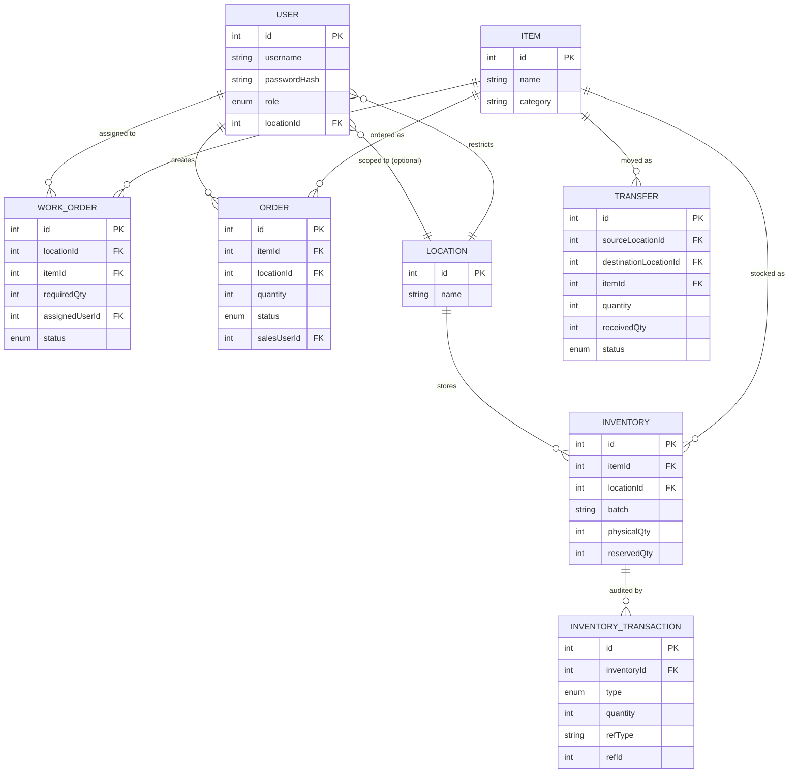

# ER Diagram - Mini Operations ERP

Paste this into https://mermaid.live to render it, or view it directly in GitHub.

## Key design notes

- **Available quantity** is never stored — it is always derived as `physicalQty - reservedQty`,
  so it can never drift out of sync.
- **`InventoryTransaction`** is an append-only audit log. Its unique constraint on
  `(refType, refId, type)` is what makes dispatch/receive/reserve/release operations
  idempotent — the same source event can never be applied to stock twice, which is how
  Test 4 ("same transfer cannot be received twice") is enforced at the database level.
- **`Inventory`** is unique per `(itemId, locationId, batch)`, which prevents duplicate
  inventory rows for the same batch and lets each location/batch be tracked independently.
